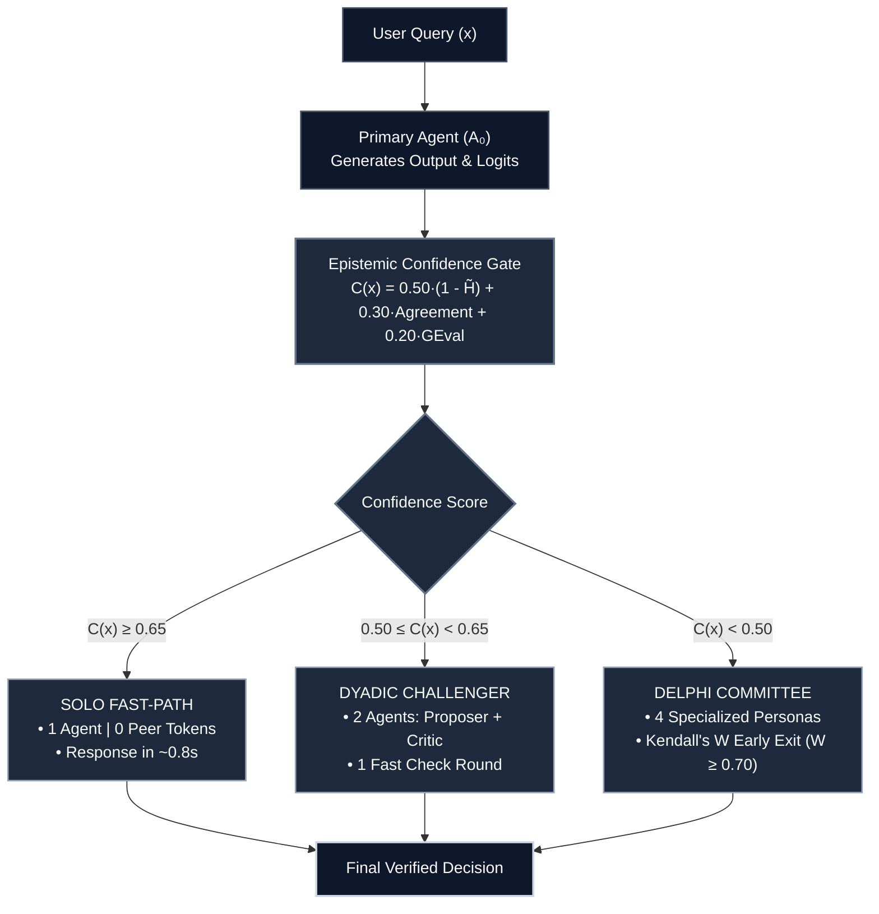

# Confidence-Gated Selective Consultation (CG-SC)

Confidence-Gated Selective Consultation is an adaptive decision-making framework for Large Language Model Multi-Agent Systems. Instead of forcing every question into a slow, expensive multi-agent debate, the system uses an epistemic confidence gate to route straightforward queries to a single fast agent, reserving specialized peer consultation only for genuine dilemmas.

---

## Architecture Flowchart



---

## Real Benchmark Results

Tested across 200 real academic questions from StrategyQA (100 questions) and MMLU Professional Law (100 questions).

```text
==========================================================================================
Architecture                        Accuracy       Avg Tokens/Query   Token Savings
------------------------------------------------------------------------------------------
Solo Agent (No Consultation)         58.50%         291.2 tokens        Baseline
Unconditional Delphi (Base Paper)    44.50%        3182.0 tokens        0.0% (Exhaustive)
CG-SC (Our Adaptive Gating)          57.00%        1562.9 tokens        50.88% SAVED
==========================================================================================
```

### Key Takeaway
On StrategyQA, unconditional debate caused single-agent accuracy to drop from 70% down to 43% because peer noise confused simple facts. By gating queries with confidence scoring, our system kept accuracy at 69% while cutting overall token costs by 50.88%.

---

## Live Commands

Run the full benchmark execution across all 200 real questions:
```bash
python3 run_full_dataset_execution.py
```

Run the streaming ethical deliberation showcase:
```bash
python3 cag_delphi_live_showcase.py
```

Run the 500-episode Monte Carlo simulation testbench:
```bash
python3 simulation_testbench.py --episodes 100
```

Run the automated mathematical proof assertions:
```bash
python3 cag_delphi_geval_proofs.py
```

---

## Project Structure

```text
cg-sc/
├── README.md                              # Architecture guide and benchmark summary
├── cag_delphi_engine/                     # Core Python decision package
│   ├── gating.py                          # Epistemic confidence estimator
│   ├── topology.py                        # Dynamic topology routing
│   ├── consensus.py                       # Kendall's W early-exit consensus
│   ├── diversity.py                       # Competing Values Framework personas
│   └── benchmark.py                       # Testbench runner
│
├── data/
│   └── real_benchmarks/                   # 200 real questions (StrategyQA + MMLU Law)
│       ├── real_decision_benchmarks.jsonl # Clean dataset
│       ├── full_run_execution_log.jsonl   # Complete execution traces
│       └── FULL_EXECUTION_AUDIT_REPORT.md # Audit table
│
├── skills/
│   └── confidence-gated-consultation/     # Global Antigravity / Claude Agent Skill
│
├── run_full_dataset_execution.py          # Main 200-question execution script
├── cag_delphi_live_showcase.py            # Live streaming showcase
├── simulation_testbench.py                # Scientific Monte Carlo testbench
└── cag_delphi_geval_proofs.py             # Automated mathematical proof verification
```
